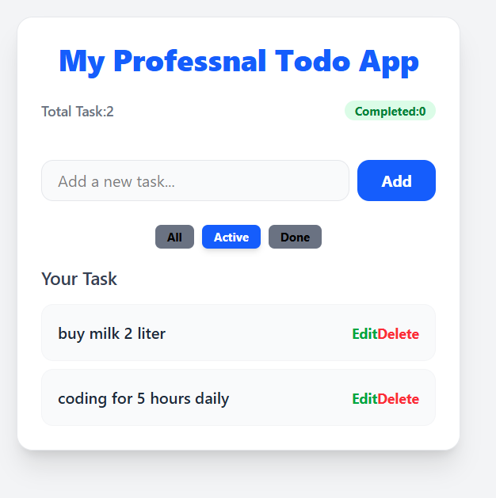

# Modern React Todo Architecture 🚀

A professional-grade Todo application built with **React 19** and **Vite**, focusing on clean code and scalable architecture.

## 🛠 Features
- **Full CRUD Operations**: Create, Read, Update (Inline Editing), and Delete tasks.
- **Custom Hooks**: Business logic is isolated in `useTodoLogic.js` for a clean `App.jsx`.
- **Filtering System**: View "All", "Active", or "Completed" tasks instantly.
- **State Persistence**: Integrated with **LocalStorage**—your tasks stay even after a page refresh.
- **Tailwind v4 Styling**: Modern, responsive UI with a "White Card" mobile-first design.

## 🧠 What I Learned
- **Custom Hooks**: How to encapsulate state and logic to make components "Dumb" and reusable.
- **Derived State**: Calculating filtered lists and task counts on the fly without extra state.
- **Prop Drilling**: Passing functions through multiple levels (`App` -> `TodoList` -> `TodoItem`).
- **Input Validation**: Using `.trim()` and "Bang" (`!`) operators to protect against empty data.

## 🚀 Live Demo
[Check out the Live App here!](YOUR_VERCEL_LINK_HERE)

## 📸 Preview

